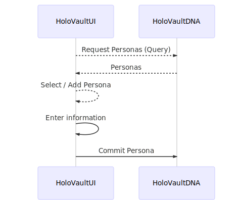
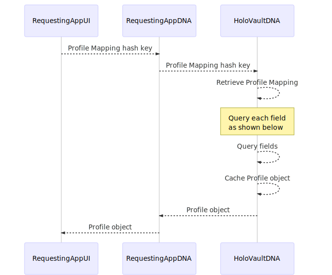
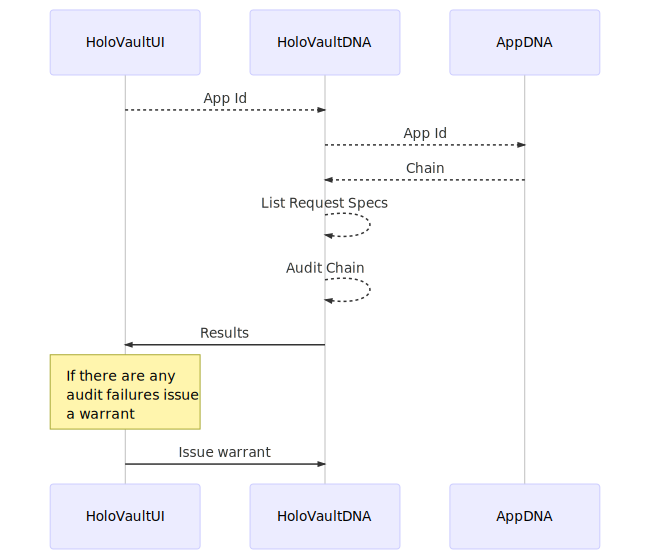

A Holochain app (hApp) built to allow people to manage how other hApps access their personal information.


## HoloVault - Personas & Profiles

European [GDPR](!https://en.wikipedia.org/wiki/General_Data_Protection_Regulation) "The GDPR aims primarily to give control back to citizens and residents over their personal data and to simplify the regulatory environment for [international business](https://en.wikipedia.org/wiki/International_business "International business") by unifying the regulation within the EU"

## This is a Core App
All apps that need a person's Profile in their app will redirect to the "HoloVault" app. The requesting app - such as HoloChat - sends a request for a Profile by sending the Identity Manager (via the Bridge) a 'Profile Spec' that lists the fields the app would like to use. The person then uses Identity Manager to manage the profile and personas.

[The code is here!](https://github.com/holochain/holo-vault)

The "HoloVault" app will have the following features:

- Enable a Requesting App to add a new Profile Mapping
- Edit a Profile Mapping
- Delete a Profile Mapping
- Add a Persona
- Edit a Persona
- Delete a Persona
- CRUD any peer content created for Apps

A disinction is made between "Persona" information and "Peer Created Content" as two different entry types in HoloVault.  HoloVault is your personal data store that replicates across your devices on its own DNA. To give you data resilience and speed to those you are sharing data with.

## Personas
You probably have many personas across your digital life.  For example in one network of peers you may use your Personal details, in another network your work details and in another your Friends. HoloVault puts you in control of how your information is used (displayed or stored by the app) and allows you to share the same information to many different apps. HoloVault also stores your Friend Graph and apps can request to use it to show you news feeds etc of those you follow and who follow you. The app that is showing you a news feed uses your graph to retrieve data from your cache, it never needs to store such information.

## Managing your Personas

You can add edit and delete Personas in the "HoloVault" app.



### Demo
You can try out the UI on the links below.  Make sure you read the *Notes* section.

[Create a New Persona](https://holochain.github.io/holo-vault/?selectedKind=HoloVault%2FPersona&selectedStory=New%20Persona&full=0&addons=1&stories=1&panelRight=0&addonPanel=storybook%2Fnotes%2Fpanel)
[Edit an Existing Persona](https://holochain.github.io/holo-vault/?selectedKind=HoloVault%2FPersona&selectedStory=Edit%20Existing%20Persona&full=0&addons=1&stories=1&panelRight=0&addonPanel=storybook%2Fnotes%2Fpanel)

## Persona Entries
```jsx=
[
    {
        "name": "Personal",
        "personaFields": [
            {"firstName": "Phil"},
            {"lastName": "Beadle"},
            {"address": "123 Holochain Road"},
            {"suburb": "Burwood"},
            {"city": "Melbourne"}
        ]
    },
    {
        "name": "Work",
        "personaFields": [
            {"firstName": "Philip"},
            {"lastName": "Beadle"},
            {"role": "Chief Engineer"},
             {"location": "Melbourne"}
        ]
    },
    {
        "name": "Friends",
        "personaFields": [
            "nickName": "@philt3r",
            "hobby": "DJ"
        ]
    }
]
```

## Managing your Profiles

You can add edit and delete Profiles in the "HoloVault" app.


### Demo
You can try out the UI on the links below.  Make sure you read the *Notes* section.
[List all Profiles](https://holochain.github.io/holo-vault/?selectedKind=HoloVault%2FProfile&selectedStory=List%20of%20Profiles&full=0&addons=1&stories=1&panelRight=0&addonPanel=storybook%2Fnotes%2Fpanel)
[Create a New Profile with no existing Personas](https://holochain.github.io/holo-vault/?selectedKind=HoloVault%2FProfile&selectedStory=New%20Profile%20no%20Existing%20Personas&full=0&addons=1&stories=1&panelRight=0&addonPanel=storybook%2Fnotes%2Fpanel)
[Create a New Profile with existing Personas](https://holochain.github.io/holo-vault/?selectedKind=HoloVault%2FProfile&selectedStory=New%20Profile%20with%20Existing%20Personas&full=0&addons=1&stories=1&panelRight=0&addonPanel=storybook%2Fnotes%2Fpanel)

### Profile Spec
Send a Profile Spec to "HoloVault" to enable the person using your app to manage their profile for your app.
```jsx=

{
  "id": "HoloChat",
  "source-dna": "QmZ4CP5unaghnmxbJkSBwobehgcF5VdcKLPimXEkwVTUYh",
  "type": "object",
  "expiry": "2018-12-12T01:01:10+00:00",
  "requiredFields": ["firstname", "address", "suburb"],
  "profile": [
    {
      "appLabel": "firstname",
      "display": "First Name",
      "required": true,
      "type": "string",
      "usage": [
        {
          "type": "display",
          "reason": "So we can show your name when people click your handle"
        },
        {
          "type": "store",
          "reason": "So we can keep a record of who we sent the order to"
        }
      ]
    },
    {
      "appLabel": "address",
      "display": "Address",
      "required": true,
      "type": "string",
      "usage": [
        {
          "type": "store",
          "reason": "So we can keep records of where we sent your order"
        }
      ]
    },
    {
      "appLabel": "suburb",
      "display": "Suburb",
      "required": true,
      "type": "string",
      "usage": [
        {
          "type": "store",
          "reason": "So we can keep records of where we sent your order"
        }
      ]
    },
    {
      "appLabel": "city",
      "display": "City",
      "required": true,
      "type": "string",
      "usage": [
        {
          "type": "store",
          "reason": "So we can keep records of where we sent your order"
        }
      ]
    }
  ]
}
```

### Creating a new Persona and Profile Mapping

The following message sequence diagram shows how a person would create a new Profile.  The app requesting the profile must display a reason it needs each of the fields it has requested. People can then confirm that their profile information has been used as requested by checking the contents of the requesting apps DHT and Chain. A warrant for the app my be issued by Identity Manager if found to be misusing people's profile information.
[Show List of Apps Installed](https://holochain.github.io/holo-vault/?selectedKind=Cells%2FCells&selectedStory=List%20of%20Cells&full=0&addons=1&stories=1&panelRight=0&addonPanel=storybook%2Fnotes%2Fpanel)


The Profile Mapping looks like this:

```jsx=
{
  "id": "HoloChat",
  "source-dna": "QmZ4CP5unaghnmxbJkSBwobehgcF5VdcKLPimXEkwVTUYh",
  "type": "object",
  "expiry": "2018-12-12T01:01:10+00:00",
  "profile":
    {
      "firstname": "Work.firstname"
      "address": "Work.address"
      "suburb": "Work.suburb"
      "city": "Work.city"
    }
}
```

In this example the following object is returned to the RequestingAppUI when it sends the Hash Key of the above Profile Mapping

#### Profile Object
```jsx=
    {
        "firstname": "Phil",
        "address": "123 Holochain Road",
        "suburb": "Burwood",
        "city": "Melbourne"
    }
```

The following sequence shows how the RequestingApp would show an existing profile for a person by querying the field names in the request mapping.
Iterate through each field and query for the Persona using the Prefix of the field.  ie Work.firstname, query for



```jsx=

#Update each field by iterating the the keys of the profile object in the mapping and parsing the key into the Persona name & Field name.

   {
      "id": "HoloChat",
      "source-dna": "QmZ4CP5unaghnmxbJkSBwobehgcF5VdcKLPimXEkwVTUYh",
      "type": "object",
      "expiry": "2018-12-12T01:01:10+00:00",
      "profile":
        {
          "firstname": "Work.firstname"
          "address": "Work.address"
          "suburb": "Work.suburb"
          "city": "Work.city"
        }
    }

    var firstname = query({Return:{Entries:true},
    {Constrain:{EntryTypes:["Persona"],
    Equals:{"name":"Personal"}})[0]['firstname']

```

# Peer Created Content
Every piece of data you create and want to **maintain control over** is kept in HoloVault by you and shared by you at your discretion.  This includes a HOLO rate to use the piece of data.  Apps then use "request spec files" to request to read your data.  You map any fields that don't auto map and grant premission for a period of time.
Apps that ask for peer content such as HoloChat and Clutter will ask you if you want to store the data you create in your "HoloVault".

When you first start using an app you can enter the content they request through HoloVault. Once you become confident that the app is using your data as you specified then you can use the apps UI (Should be a better more targeted experice) to manage content.

## Forensic Auditing - Attack Factory
At any time people can use HoloVault to do a forensic scan on any apps chain and dht to give them confidence the app is managing your data as specified.




# Permalinks App
Permanent public storage of a piece of peer created content data.

## Gamification Data

Reputation & Experience and other metrics about you on different apps should also be **your data** and kept in HoloVault.  Apps then request to result of a gamification algo based on your data, they dont need your data just the results.  Ie the result is creating a leaderboard.

## Get rewarded for your insights
The model at the moment is that everything we add to the internet via Facebook, Twitter etc is used in advertising algorithms, we are the product. it si not necessary for these data mining companies to actually own your data, what they want is the insight. With HoloVault you could run an advertisers algorithm and get paid to publish the result back to them.
